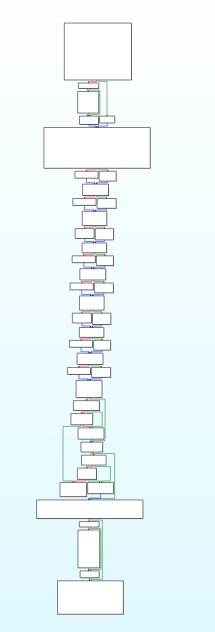

# Cloakwork

**Cloakwork** is an advanced header-only C++20 obfuscation library providing comprehensive protections against static and dynamic analysis. It is highly configurable, extremely modular, and can be embedded directly with no separate compilation step needed. No dependencies required. This was a college project that spiraled into what it is now, so enjoy.

> Inspired by [obfusheader.h](https://github.com/ac3ss0r/obfusheader.h) and Zapcrash's nimrodhide.h

**Author:** helz.dev on Discord  
**License:** MIT

***

## ✨ Features

- **Compile-time string encryption**
  - Encrypts string literals and decrypts on-the-fly at runtime.
- **Integer/value obfuscation**
  - Protects sensitive values with random key-based encoding and mutation.
- **Data hiding & scattering**
  - Splits and scrambles user data across memory or in polymorphic wrappers.
- **Control flow obfuscation**
  - Opaque predicates, control flow flattening, branch indirection, and dead code insertion.
- **Function pointer obfuscation**
  - Hides pointers with multi-layer, runtime-unique indirection and anti-debug logic.
- **Anti-debugging**
  - Multiple techniques including timing checks, PEB inspection, heap flag checks, int3/hardware breakpoint detection, and more.
- **Anti-analysis**
  - Detects debuggers, analysis tools, hardware breakpoints.
- **Virtualization engine**
  - Compile-time random polymorphic bytecode generation, custom interpreter with scattered state, and morphing instruction encoding.
- **Metamorphic code generation**
  - Self-mutating code and cross-variant function dispatching.
- **Fake signatures**
  - Embeds dummy packer/watermarks (Themida, VMProtect, Enigma, etc.) to trip up signature scanners.
- **Compile-time randomization**
  - All transformations and injections use compile-time random ribbons, no two builds are alike.
- **Full modular configuration**
  - Every feature is a toggle, disable heavy modules for performance or size.

***
Below is an image from IDA after compilation of demo.cpp, wherein all strings are hidden and there are various subroutines, all polymorphed and hidden.


***

## ⚡ Quick Usage

Add to your project (no build step needed):

```cpp
#include "cloakwork.h"
```

**String Encryption:**
```cpp
const char* msg = CWSTR("secret message");
// automatically decrypted at runtime only
```

**Obfuscated Value:**
```cpp
int key = CWINT(0xDEADBEEF); // cryptographically wrapped integer
```

**Scatter Data in RAM:**
```cpp
auto hidden = CWSCATTER(myStructInstance);
```

**Obfuscated If/Else:**
```cpp
CWIF(is_authenticated)
    process_secure_data();
CWCHECKANALYSIS // crashes if being debugged
CWELSE
    handle_error();
```

**Flatten Complex Logic:**
```cpp
auto safe_val = CWFLATTEN([](int v) { return v * 2; }, user_val);
```

**Anti-Debug One-Liner:**
```cpp
CWANTIDEBUG // will crash (volatile) if a debugger is attached
```

**Virtualization:**
```cpp
CWVMSTART;
CWVMPUSH(secret);
CWVMPUSH(0xBEEF);
CWVMXOR;
uint64_t result = CWVMEXECUTE;
```

***

## 🛠️ Configuration

Tweak features by defining feature macros **before** including the header:
```cpp
#define CWENABLEVIRTUALIZATION 0
#define CWENABLESTRINGENCRYPTION 1
#include "cloakwork.h"
```
- `CWENABLEALL` – Master on/off (default: 1)
- `CWENABLESTRINGENCRYPTION` – String encryption
- `CWENABLEVALUEOBFUSCATION` – Integer/value obfuscation
- `CWENABLECONTROLFLOW` – Control flow obfuscation
- `CWENABLEANTIDEBUG` – Anti-debugging
- `CWENABLEFUNCTIONOBFUSCATION` – Function pointer obfuscation
- `CWENABLEDATAHIDING` – Data scattering/polymorphic
- `CWENABLEMETAMORPHIC` – Metamorphic code
- `CWENABLEFAKESIGNATURES` – Dummy signatures/watermarks
- `CWENABLEVIRTUALIZATION` – Bytecode virtualization
- `CWENABLECOMPILETIMERANDOM` – Compile-time randomization

All features are **enabled by default**. For pure minimal config:

```cpp
#define CWENABLEALL 0
#define CWENABLESTRINGENCRYPTION 1
#define CWENABLEVALUEOBFUSCATION 1
#include "cloakwork.h"
```

***

## 📚 API Reference & Macros

- `CWSTR(s)` – Encrypts a string literal.
- `CWINT(x)` – Obfuscated integer.
- `CWPOLY(x)` – Polymorphic (mutating) value.
- `CWSCATTER(x)` – Scatters struct/class in RAM.
- `CWIF(expr)` / `CWELSE` – Opaque (obfuscated) if/else.
- `CWFLATTEN(fn, ...)` – Control flow flattening.
- `CWCALL(fn)` – Obfuscated function call.
- `CWANTIDEBUG` – Crashes if debugger detected.
- `CWCHECKANALYSIS` – Comprehensive anti-analysis check.
- `CWBRANCH(cond)` – Indirect branch obfuscation.
- `CWVMSTART`, `CWVMPUSH(x)`, `CWVMADD` etc – Manual bytecode builder.
- `CWVIRTUALIZE(expr)` – Quick virtualization of any expression.

***

## 💡 Advanced Integration

All features are **header-only** and are **Windows-focused** (with advanced anti-debug using Win32 if available). C++20 and above required for best results.

- Use fake signatures to trick static scanners.
- Deep integration possible with custom VM interpreter and scatter/polymorphic wrappers.
- Metamorphic function patterns confuse codeflow analysis.
- Anti-debug lets you nuke analysis tools silently with minimal false positives.

***

## 🪪 Credits

- Inspired by legendary tools: obfusheader.h, nimrodhide.h, and the anti-re tools of unknowncheats.
- Created by helz.dev/Helzky / Discord: `helz.dev`
- Open for contributions and issues! Please submit issues via Github or DM me directly!

***

## ⚖️ License

MIT License – do what you want, no warranty.

***

**Cloakwork: Ultra-obfuscated, ultra-useful… Happy hiding!**

---
